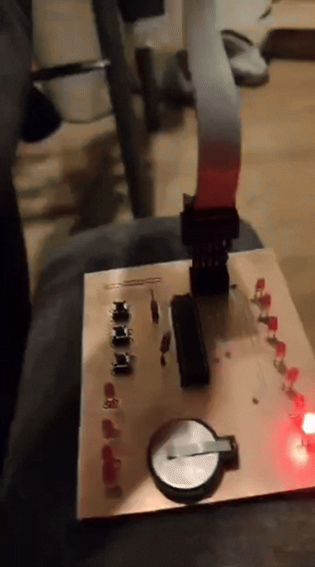
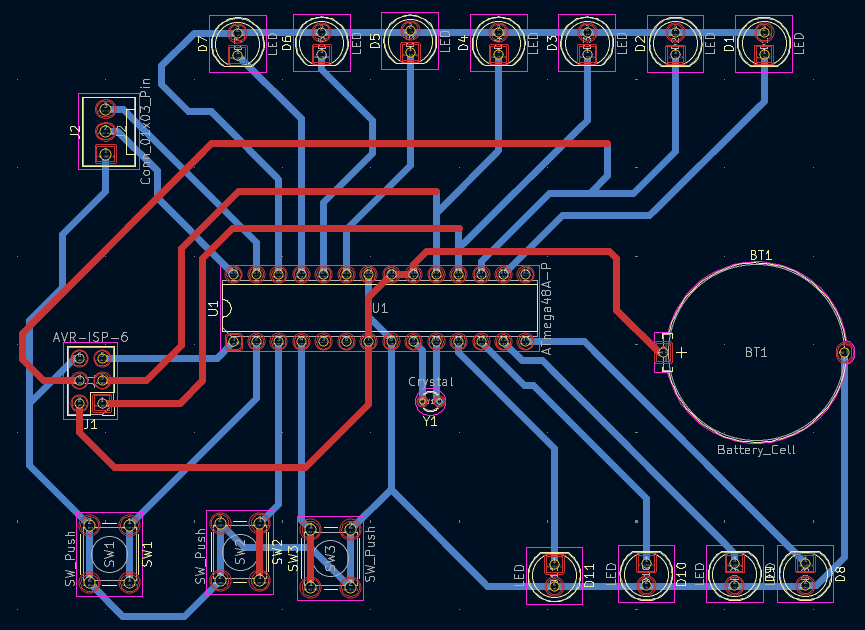

# Binary Clock
> Status: Finished

> Authors:
>  Julian Wappler

## About the Project

I developed a binary clock as part of a university project. The clock displays the hours using 4 LEDs and the minutes using 7 additional LEDs.

Besides writing the software, I also designed the physical clock myself, milled the housing, soldered the electronic components, and assembled the final device. I used PlatformIO with Visual Studio Code for the development and programming of the microcontroller. This repository contains the program code used to control the binary clock.

## GIF Seconds Mode Demo & Platine Schemata

 

## Features
- Binary time display
- 4 LEDs for displaying the hours
- 7 LEDs for displaying the minutes
- Optional seconds display mode
- Sleep mode
- Adjustable LED brightness
- Manual time setting
- Self-designed clock housing
- Milled and assembled physical case
- Hand-soldered electronic components
- Developed using PlatformIO and Visual Studio Code
- Program code for controlling the ATmega48 microcontroller


## Tech Stack


| Technology / Library | Purpose |
|----------------------|---------|
| C++ | Programming the microcontroller logic |
| PlatformIO | Building, configuring, and uploading the firmware |
| Visual Studio Code | Development environment |
| AVR Microcontroller | Hardware platform for controlling the binary clock |
| `<avr/io.h>` | Accessing AVR input/output registers |
| `<avr/interrupt.h>` | Handling interrupts |
| `<util/delay.h>` | Creating time delays |
| `<stdbool.h>` | Using boolean values |
| `<stdint.h>` | Using fixed-width integer types |


## Software Bill of Materials

This project does not currently require a separate Software Bill of Materials because it does not use any external third-party libraries or additional package dependencies.

The firmware only relies on standard AVR/C libraries, such as `avr/io.h`, `avr/interrupt.h`, `util/delay.h`, `stdbool.h`, and `stdint.h`, together with the PlatformIO build environment for the ATmega48 microcontroller.

## Requirements

To build and upload this project, the following tools and hardware are required:

- Visual Studio Code
- PlatformIO extension for Visual Studio Code
- AVR toolchain
- USBasp programmer
- ATmega48 microcontroller

## Check Requirement

Check if PlatformIO is installed:

```bash
pio --version
```

Check if the project configuration is detected:

```bash
pio project config
```

List connected devices and ports:

```bash
pio device list
```

Build / compile the firmware:

```bash
pio run -e ATmega48
```

Check the USBasp connection to the ATmega48:

```bash
avrdude -c usbasp -p m48 -B64
```

Upload / flash the firmware to the microcontroller:

```bash
pio run -e ATmega48 -t upload
```

Open the serial monitor:

```bash
pio device monitor -p COM8 -b 4800
```


### Compile & Upload

The source code is translated into a .hex file for the ATmega48:

```powershell
pio run -e ATmega48
```

The compiled program is transferred to the microcontroller:

```powershell
pio run -e ATmega48 -t upload
```


